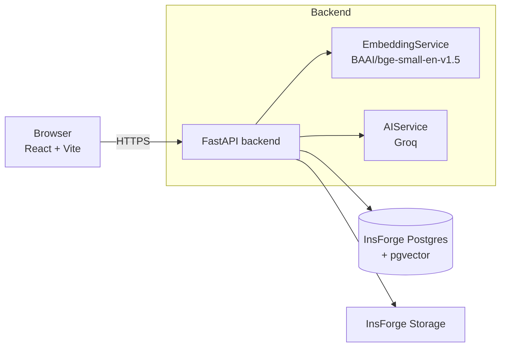
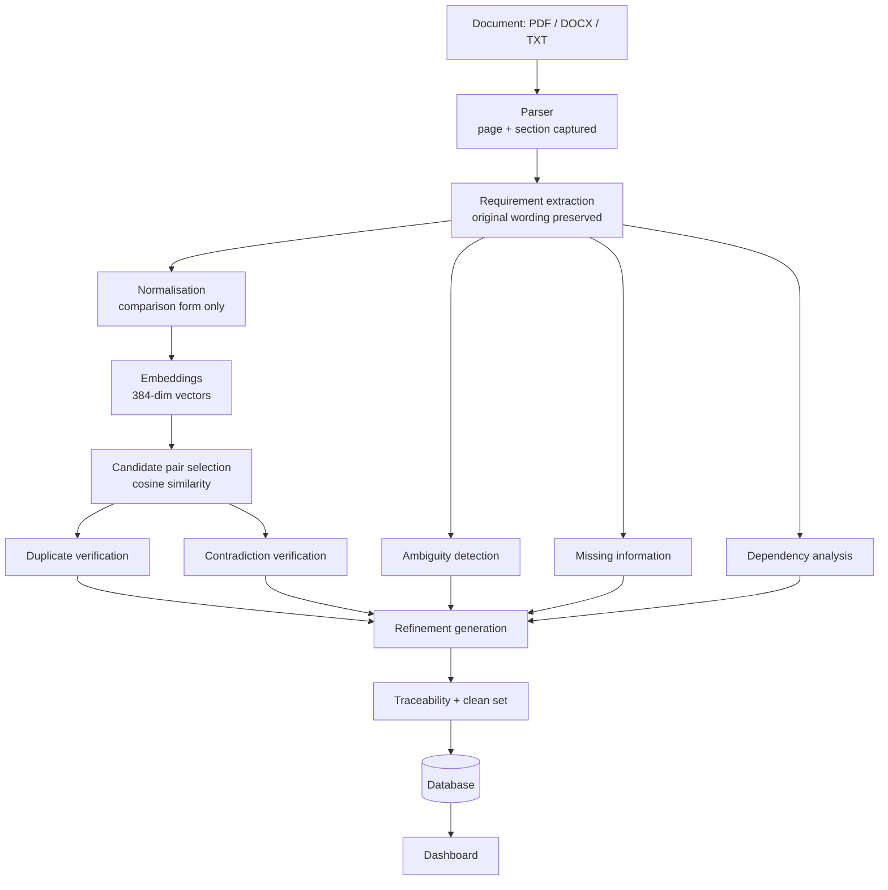

# ReqGuard AI

**Find requirement problems before they become software problems.**

ReqGuard AI is a requirements-engineering agent. Upload a Software Requirements
Specification and it extracts the individual requirements, then reports the
ambiguities, contradictions, duplicates, missing details and hidden dependencies
inside it. Every finding quotes evidence from your document and links back to the
requirement it came from.

Built for the Delulu 2 Deploy hackathon, problem statement **G14** (Generative AI).

---

## Contents

- [Problem statement](#problem-statement)
- [What it produces](#what-it-produces)
- [Architecture](#architecture)
- [The analysis pipeline](#the-analysis-pipeline)
- [Tech stack](#tech-stack)
- [Getting started](#getting-started)
- [Environment variables](#environment-variables)
- [Database setup](#database-setup)
- [AI configuration](#ai-configuration)
- [API reference](#api-reference)
- [Testing](#testing)
- [Evaluation](#evaluation)
- [Deployment](#deployment)
- [Demo instructions](#demo-instructions)
- [Design decisions](#design-decisions)
- [Known limitations](#known-limitations)

---

## Problem statement

Requirements documents are where software projects go wrong first. A requirement
that says "the application shall respond quickly" cannot be tested. Two
requirements that each claim exclusive control of how users log in cannot both be
built. A requirement repeated in two sections gets implemented twice. None of
this is visible until someone reads the whole document carefully, and most teams
never do.

ReqGuard analyses the specification before implementation begins, and shows its
working for every problem it reports.

## What it produces

| Output | Description |
|---|---|
| **Clean requirement set** | Every requirement, with accepted refinements applied and confirmed duplicates marked. The original wording is always retained. |
| **Ambiguity report** | Requirements an engineer and a tester could read differently, with the offending term quoted. |
| **Contradiction report** | Requirement pairs that cannot both be satisfied, shown side by side with the conflicting clause from each. |
| **Duplicate report** | Pairs confirmed to state the same requirement, with the embedding similarity that surfaced them. |
| **Dependency graph** | An interactive graph of which requirements must be built before others. |
| **Traceability matrix** | Every requirement, its source section and page, and every finding raised against it. |

## Architecture



The frontend never talks to the database or holds an API key. All credentials stay
server-side; the browser only calls the FastAPI service.

## The analysis pipeline

Each stage is a separate service with its own prompt and its own tests. There is
no single prompt that "does the analysis".



**Why the two-stage design matters.** Comparing every requirement against every
other is quadratic: 100 requirements is 4,950 pairs. Sending all of those to a
language model is slow and expensive. Instead, embeddings rank the pairs by
meaning and only those above a configurable similarity threshold reach the model.
On the sample specification this cuts 1,128 possible pairs to 16 duplicate
candidates and 265 contradiction candidates.

Similarity alone never decides anything. It only chooses what is worth reasoning
about; the model makes the call, and must quote evidence for it.

## Tech stack

**Frontend** — React 19, TypeScript, Vite, Tailwind CSS v4, React Flow
(`@xyflow/react`), Lucide icons, React Router.

**Backend** — Python 3.12+, FastAPI, Uvicorn, Pydantic v2.

**AI** — Groq (`openai/gpt-oss-20b`) for reasoning. An OpenRouter-compatible
client is included as an alternative provider, selected by `LLM_PROVIDER`.

**Embeddings** — `BAAI/bge-small-en-v1.5` via sentence-transformers, 384
dimensions, with scikit-learn cosine similarity.

**Database** — InsForge PostgreSQL with the `vector` extension.

**Document parsing** — pypdf, python-docx, plain text.

---

## Getting started

### Prerequisites

- Python 3.12 or newer
- Node.js 20 or newer
- An InsForge project
- A Groq API key (free at [console.groq.com](https://console.groq.com))

### Backend

```bash
cd backend
python -m pip install -r requirements.txt
cp .env.example .env          # then fill in the values
uvicorn app.main:app --reload --port 8000
```

First start downloads the embedding model (about 130 MB) and caches it.

Check it came up:

```bash
curl http://localhost:8000/health
curl http://localhost:8000/api/system/status
```

`/api/system/status` reports whether the database, embedding model and LLM are
each actually usable — useful when something is misconfigured.

### Frontend

```bash
cd frontend
npm install
cp .env.example .env          # set VITE_API_URL
npm run dev
```

Open <http://localhost:5173>.

## Environment variables

### Backend (`backend/.env`)

| Variable | Required | Default | Purpose |
|---|---|---|---|
| `INSFORGE_URL` | yes | — | InsForge project URL |
| `INSFORGE_API_KEY` | yes | — | InsForge admin key. **Server-side only.** |
| `INSFORGE_STORAGE_BUCKET` | no | `reqguard-documents` | Bucket for uploaded files |
| `LLM_PROVIDER` | no | `groq` | `groq` or `openrouter` |
| `GROQ_API_KEY` | yes (for Groq) | — | Groq API key |
| `GROQ_MODEL` | no | `openai/gpt-oss-20b` | Groq model |
| `GROQ_REASONING_EFFORT` | no | provider default | `low` recommended on the free tier (fewer hidden reasoning tokens) |
| `LLM_RATE_LIMIT_WAIT_SECONDS` | no | `180` | How long one call may wait out a per-minute rate limit |
| `OPENROUTER_API_KEY` | yes (for OpenRouter) | — | Alternative provider key |
| `CORS_ORIGINS` | no | localhost:5173 | Comma-separated allowed origins |
| `DUPLICATE_SIMILARITY_THRESHOLD` | no | `0.82` | Duplicate candidate cutoff |
| `CONTRADICTION_SIMILARITY_THRESHOLD` | no | `0.70` | Contradiction candidate cutoff |
| `MAX_CANDIDATE_PAIRS` | no | `300` | Cap on pairs sent to the model |
| `MIN_CONFIDENCE_CONTRADICTION` | no | `0.60` | Reporting floor |
| `MIN_CONFIDENCE_PARTIAL_CONFLICT` | no | `0.85` | Reporting floor for the weaker class |
| `MAX_UPLOAD_BYTES` | no | `15728640` | Upload size limit |

### Frontend (`frontend/.env`)

| Variable | Required | Purpose |
|---|---|---|
| `VITE_API_URL` | yes | Backend base URL, e.g. `https://reqguard-api.onrender.com` |

No secret belongs in a `VITE_` variable: everything with that prefix is compiled
into the browser bundle.

## Database setup

The schema lives in `migrations/` and is applied with the InsForge CLI:

```bash
npx -y @insforge/cli db migrations up --all
npx -y @insforge/cli storage create-bucket reqguard-documents --private
```

Seven tables are created: `documents`, `requirements`, `analysis_runs`, `issues`,
`issue_relationships`, `dependencies`, `refinements`.

Row level security is enabled on all of them with **no** permissive policies. The
backend reaches them with the admin key, which bypasses RLS; the public anon key
is rejected by Postgres. The browser has no database access at all.

Embeddings are stored in a `vector(384)` column with an HNSW cosine index.

## AI configuration

Every model call goes through `AIService` (`backend/app/ai/ai_service.py`). It is
the only place in the codebase that talks to a language model.

- Each call requests a JSON object and is validated against a Pydantic schema.
- Invalid JSON triggers one retry with a correction prompt.
- If the retry also fails, the stage raises and the run is marked failed. The
  system never substitutes a fabricated result.

To switch providers, set `LLM_PROVIDER=openrouter` and supply
`OPENROUTER_API_KEY`. Nothing above the transport layer changes.

**Groq free tier.** A free key allows 8,000 tokens per minute and 200,000
tokens per day, counted separately for each model. A full analysis of the
48-requirement sample uses about 100,000 tokens and takes about 13 minutes, so a
free key supports roughly two full analyses per model per day. The client is
built for this:

- A per-minute `429` is waited out using the provider's `retry-after`, up to
  `LLM_RATE_LIMIT_WAIT_SECONDS` per call. A daily-quota `429` asks for a much
  longer wait, so the run fails immediately with a clear message instead of
  hanging.
- `GROQ_REASONING_EFFORT=low` cuts the hidden reasoning tokens of `gpt-oss`
  models. On a real ambiguity call it used 27% fewer tokens with identical
  findings.
- In JSON mode Groq rejects a malformed generation with a `400
  json_validate_failed` instead of returning it. The client treats that as an
  invalid model response, so the usual correction retry runs instead of the
  analysis aborting.

## API reference

| Method | Path | Purpose |
|---|---|---|
| `GET` | `/health` | Liveness probe |
| `GET` | `/api/system/status` | Readiness of database, embeddings and LLM |
| `POST` | `/api/documents/upload` | Upload an SRS (multipart `file`) |
| `POST` | `/api/documents/{id}/analyze` | Start analysis |
| `GET` | `/api/documents/{id}/status` | Stage, progress percentage, stats |
| `GET` | `/api/documents/{id}/requirements` | Extracted requirements |
| `GET` | `/api/documents/{id}/issues` | All issues; filters: `type`, `severity`, `requirement_id`, `min_confidence` |
| `GET` | `/api/documents/{id}/ambiguities` | Ambiguity report |
| `GET` | `/api/documents/{id}/contradictions` | Contradiction report |
| `GET` | `/api/documents/{id}/duplicates` | Duplicate report |
| `GET` | `/api/documents/{id}/missing-information` | Missing information report |
| `GET` | `/api/documents/{id}/dependencies` | Graph nodes and edges |
| `GET` | `/api/documents/{id}/traceability` | Traceability matrix |
| `GET` | `/api/documents/{id}/clean-requirements` | Clean requirement set |
| `GET` | `/api/documents/{id}/export?format=json\|markdown` | Export |
| `POST` | `/api/refinements/{id}/accept` | Accept a suggested rewrite |
| `POST` | `/api/refinements/{id}/reject` | Reject it |
| `POST` | `/api/refinements/{id}/edit` | Save an edited version |

Interactive documentation is at `/docs` when the backend is running.

## Testing

```bash
cd backend
python -m pytest tests -q
```

83 tests covering PDF/DOCX/TXT parsing, upload validation, embedding generation,
similarity and candidate selection, each detection stage, AI response validation
and retry behaviour, provider rate-limit and JSON-rejection handling, reference
resolution, the API endpoints, traceability, the clean requirement set, and the
refinement round trip.

The tests use a fake model and an in-memory database, so they need no network
access and spend nothing.

To exercise the real system end to end against a running backend:

```bash
python verify_demo_flow.py http://localhost:8000
```

To check the frontend in a real browser (both servers running), with real mouse
clicks, so a control hidden under another element fails the way it would for a
user:

```bash
cd docs
npm init -y && npm i playwright    # once; uses your installed Microsoft Edge
node ui_check.mjs <document_id>
```

## Evaluation

`samples/evaluation_dataset.json` holds ground-truth labels for the sample
specification. `backend/evaluate.py` scores a completed run against them:

```bash
python evaluate.py <document_id>
```

Measured on the sample specification (48 requirements), one run per model,
same document and same labels. Each cell is precision / recall / F1:

| Stage | Groq `gpt-oss-20b` (reasoning: low) | OpenRouter `gpt-4o-mini` |
|---|---|---|
| Requirement extraction | 1.00 / 1.00 / 1.00 | 1.00 / 1.00 / 1.00 |
| Ambiguity detection | 0.80 / 1.00 / 0.89 | 0.67 / 1.00 / 0.80 |
| Contradiction detection | 0.50 / 1.00 / 0.67 | 0.08 / 1.00 / 0.15 |
| Contradiction (confidence ≥ 0.9) | 0.75 / 1.00 / 0.86 | 0.20 / 1.00 / 0.33 |
| Duplicate detection | 0.14 / 1.00 / 0.25 | 0.33 / 1.00 / 0.50 |
| Dependencies (undirected) | 0.10 / 1.00 / 0.18 | 0.04 / 0.33 / 0.08 |
| Missing information | 0.03 / 0.50 / 0.05 | 0.09 / 1.00 / 0.16 |

Traceability: every issue carried a source requirement id in both runs (60 of 60
on Groq, 76 of 76 on OpenRouter).

**Read these numbers carefully.** Recall is high: the labelled problems are
almost all found. Groq missed one of the two labelled missing-information items.
Precision is lower, and two separate things cause that:

1. The ground-truth set is deliberately small — 3 labelled contradictions, 2
   labelled missing-information items, 1 labelled duplicate. Many findings
   counted as false positives are real problems that simply are not labelled.
2. Contradiction detection can over-report. A requirement containing "only"
   conflicts with many others, so one bad requirement can produce a cascade of
   true-but-redundant pairs. This was severe with `gpt-4o-mini` (38 findings)
   and much milder with `gpt-oss-20b` (6 findings).

The two models trade off: Groq is better on contradictions, ambiguities and
dependencies, and worse on duplicates and missing information.

These are measurements from one run on one small document. They are not a general
accuracy claim, and no number in the application is hard-coded.

## Deployment

### Backend — Render

`backend/render.yaml` is a ready blueprint. Point Render at the repository, set
`INSFORGE_URL`, `INSFORGE_API_KEY`, `GROQ_API_KEY` and `CORS_ORIGINS` in the
dashboard, and deploy. Health checks use `/health`.

The embedding model needs roughly 500 MB of RAM, so the free instance type is not
enough; use Starter or larger.

### Frontend — Vercel

```bash
cd frontend
vercel --prod
```

Set `VITE_API_URL` to the deployed backend URL in the Vercel project settings,
then add that Vercel domain to `CORS_ORIGINS` on the backend.

Neither service assumes localhost: the frontend reads `VITE_API_URL` and the
backend reads `CORS_ORIGINS`.

## Demo instructions

1. Open the app and press **Analyze SRS**.
2. Press **Use the sample E-Commerce SRS** (it loads the real 48-requirement
   `ECommerce_SRS_Hackathon_Sample.docx`), or drop in your own PDF, DOCX or TXT.
3. Press **Analyze Requirements** and watch the stages report progress.
4. The dashboard opens with counts for each finding type.
5. **Ambiguity report** — open a finding to see the quoted term, why it is
   unverifiable, and a measurable rewrite.
6. **Contradiction report** — two conflicting requirements side by side, each with
   its own evidence.
7. **Duplicate report** — the embedding similarity that surfaced the pair and the
   model's verdict.
8. **Dependency graph** — click a node to see what it depends on and what depends
   on it.
9. **Traceability matrix** — search, then click a row to open the requirement and
   every finding against it.
10. **Clean requirements** — accept, edit or reject a refinement, then **Export
    Clean SRS**.

The sample document contains deliberate duplicates, contradictions, ambiguities
and gaps. None of its findings are hard-coded; the pipeline discovers them.

## Design decisions

**Original wording is never overwritten.** Extraction copies the requirement
exactly as printed. Normalisation produces a separate comparison string used only
for embeddings. Refinements are stored as proposals in their own table; accepting
one changes what the clean set renders, not the stored requirement.

**Every finding must trace to a requirement.** Issues carry a requirement id, and
pair findings carry both. A finding that cannot be traced is not reported.

**Models return codes, but not reliably.** Prompts ask for `R001`; models often
answer with the whole requirement sentence instead. `RequirementResolver` accepts
a code, a code embedded in text, an echoed sentence or a truncated quote. Without
it, correct findings were silently discarded — the first end-to-end run reported
zero duplicates and zero contradictions for exactly this reason.

**Thresholds are configurable because no single value is right.** The candidate
thresholds and confidence floors are settings, not constants. The defaults were
chosen by measuring the similarity distribution of the sample, not guessed.

**Failures are visible.** An analysis stage that cannot parse a model response
fails the run and records why. Nothing is invented to fill a gap.

## Known limitations

- **Contradictions can cascade.** One requirement with an exclusivity clause can
  generate several true-but-redundant conflict pairs. How badly depends on the
  model (6 findings on Groq `gpt-oss-20b`, 38 on `gpt-4o-mini`). The report has a
  "direct contradictions only" filter, and the confidence floors are tunable, but
  grouping cascading conflicts under a single root cause is not implemented.
- **Missing-information and duplicate findings are noisy** on Groq: 37
  missing-information findings against 2 labels, and 7 duplicate pairs against
  1 label.
- **Dependency recall varies between runs.** Requirements are analysed in
  overlapping windows, so an edge between two distant requirements may be missed.
- **Analysis takes about 13 minutes** for a 48-requirement document on a free
  Groq key. The 8,000 tokens-per-minute limit sets the pace, not the model's
  speed, so running stages concurrently would not help on the free tier. A paid
  tier would.
- **A free Groq key supports about two full analyses per model per day**
  (200,000-token daily quota, about 100,000 tokens per analysis).
- **The evaluation set is small.** It covers one document and a handful of labels.
  Treat the reported figures as a smoke test of behaviour, not a benchmark.
- **Uploaded bytes are held in memory** between upload and analysis, so a restart
  between the two steps requires re-uploading.
